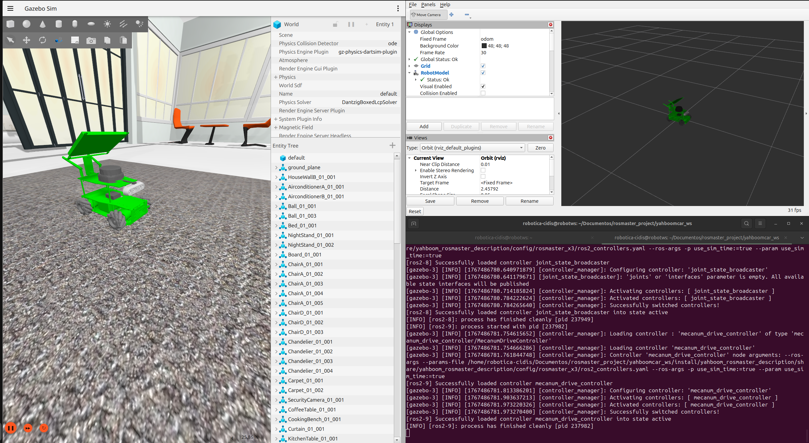
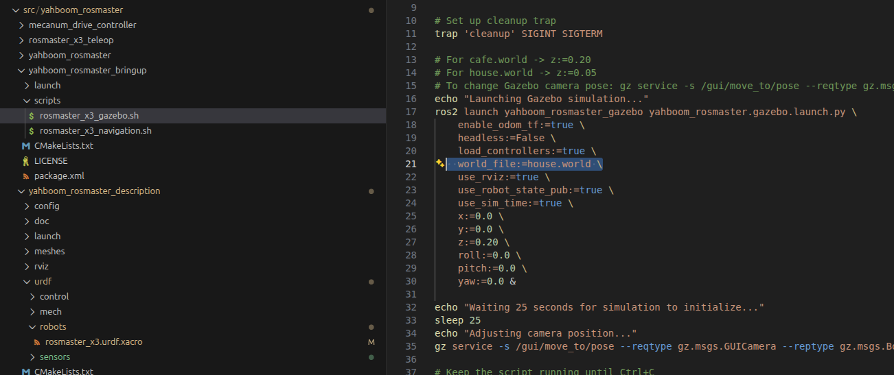
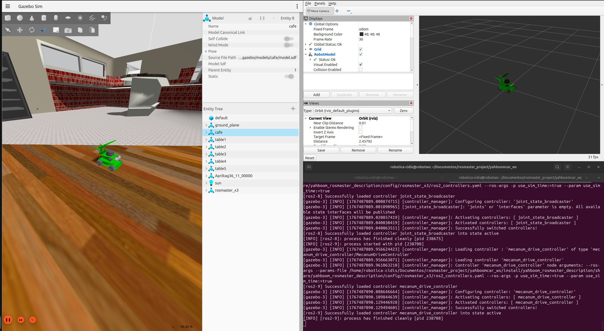
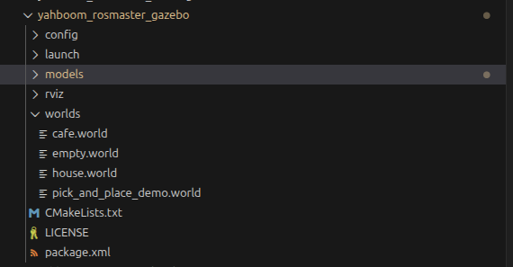
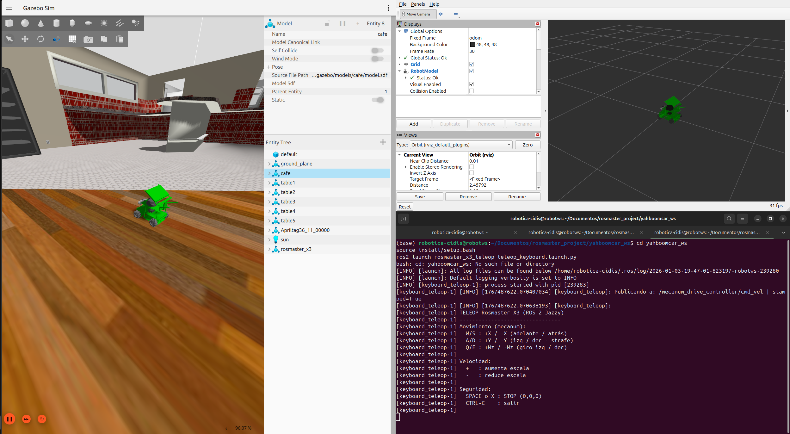
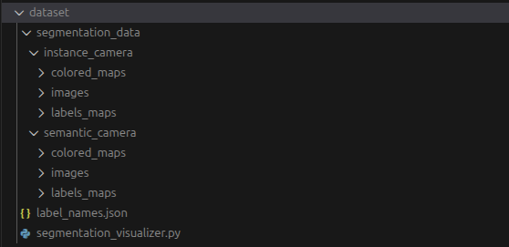
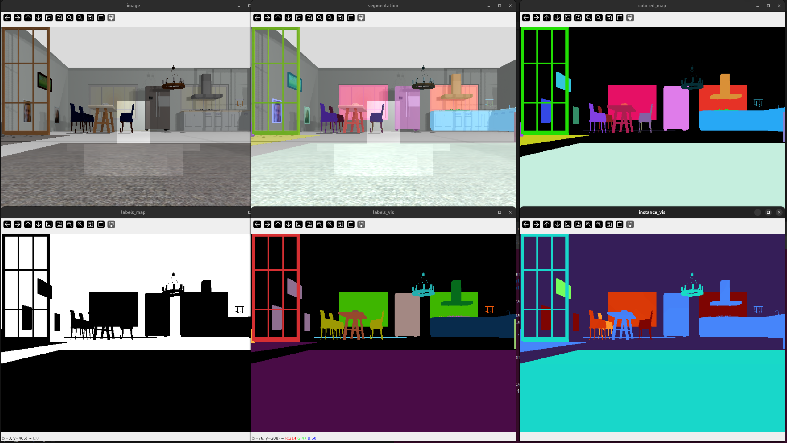
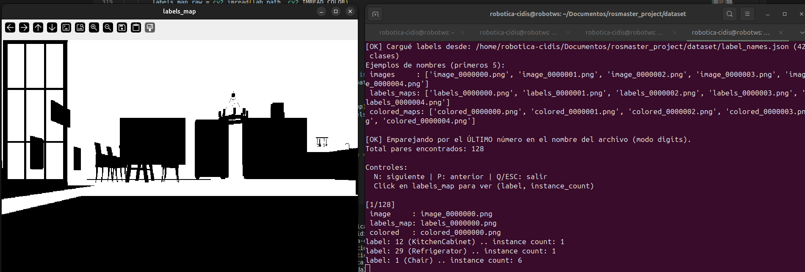

# ROSMASTER X3 + Gazebo (ROS 2 Jazzy) + Dataset de Segmentación

> Proyecto de simulación del **Yahboom ROSMASTER X3** en **Gazebo Sim** (ROS 2 **Jazzy**) con teleoperación por teclado y generación automática de dataset de segmentación (instance + semantic).

---

## 🧭 Tabla de contenidos

- [Requisitos](#-requisitos)
- [Descarga del repositorio](#-descarga-del-repositorio)
- [Instalación de dependencias](#-instalación-de-dependencias)
- [Compilación del workspace](#-compilación-del-workspace)
- [Iniciar la simulación](#-iniciar-la-simulación)
- [Cambiar de mundo](#-cambiar-de-mundo)
- [Agregar nuevos mundos](#-agregar-nuevos-mundos)
- [Teleoperación (teclado)](#-teleoperación-teclado)
- [Dataset de segmentación](#-dataset-de-segmentación)
- [Visualizador del dataset](#-visualizador-del-dataset)
- [Clases (labels) y diccionario](#-clases-labels-y-diccionario)
- [Agregar nuevas clases](#-agregar-nuevas-clases)
- [Hacer que la cámara detecte nuevas clases (label plugin)](#-hacer-que-la-cámara-detecte-nuevas-clases-label-plugin)

---

## ✅ Requisitos

Entorno probado:

- **Ubuntu 24.04.3 LTS (noble)**, sesión **X11**
- **ROS 2 Jazzy**
- **Gazebo Sim 8.10.0** (gz-sim8)

---

## ⬇️ Descarga del repositorio

Repositorio remoto:

- `https://github.com/juanfranciscosm/rosmaster_project.git`

Clonar:

```bash
git clone https://github.com/juanfranciscosm/rosmaster_project.git
cd rosmaster_project
```

---

## 📦 Instalación de dependencias

### 1) Dependencias ROS (rosdep)

Desde el workspace `yahboomcar_ws`:

```bash
cd yahboomcar_ws
rosdep install --from-paths src --ignore-src -r -y
```

> Esto resuelve dependencias declaradas en los `package.xml`.

### 2) Dependencias Python para el visualizador del dataset

```bash
python3 -m pip install --user opencv-python numpy
```

---

## 🏗️ Compilación del workspace

```bash
cd yahboomcar_ws
colcon build
source install/setup.bash
```

Opcional (alias sugeridos en `~/.bashrc`):

```bash
alias build='cd ~/Documentos/rosmaster_project/yahboomcar_ws && colcon build && source ~/.bashrc'
alias x3='bash ~/Documentos/rosmaster_project/yahboomcar_ws/src/yahboom_rosmaster/yahboom_rosmaster_bringup/scripts/rosmaster_x3_gazebo.sh'
```

---

## ▶️ Iniciar la simulación

### Opción A (recomendada): script `rosmaster_x3_gazebo.sh`

Ejecuta el script que lanza Gazebo + controladores + RViz:

```bash
x3
```

> El script usa `ros2 launch yahboom_rosmaster_gazebo yahboom_rosmaster.gazebo.launch.py` y define `world_file`, pose inicial del robot, etc.

<!-- TODO: agrega una captura del Gazebo abierto con el robot -->


### Opción B: lanzar directo (sin script)

Puedes lanzar el `launch.py` directamente (útil para pasar parámetros como el mundo, pose, etc.):

```bash
ros2 launch yahboom_rosmaster_gazebo yahboom_rosmaster.gazebo.launch.py \
  enable_odom_tf:=true \
  headless:=False \
  load_controllers:=true \
  world_file:=house.world \
  use_rviz:=true \
  use_robot_state_pub:=true \
  use_sim_time:=true \
  x:=0.0 y:=0.0 z:=0.05 roll:=0.0 pitch:=0.0 yaw:=0.0
```

---

## 🌍 Cambiar de mundo

Tienes dos caminos:

### 1) Cambiar el mundo por defecto en el script

Editar:

```
yahboomcar_ws/src/yahboom_rosmaster/yahboom_rosmaster_bringup/scripts/rosmaster_x3_gazebo.sh
```

y cambiar la línea:

```bash
world_file:=house.world
```

Por ejemplo:

```bash
world_file:=cafe.world
```




> Nota: en el mismo script también se ajusta la altura inicial (`z`) dependiendo del mundo (ej: `cafe.world` usa `z:=0.20`, `house.world` usa `z:=0.05`).

### 2) Pasar `world_file` al `launch.py` (sin editar archivos)

```bash
ros2 launch yahboom_rosmaster_gazebo yahboom_rosmaster.gazebo.launch.py world_file:=cafe.world z:=0.20
```

<!-- TODO: agrega una captura comparando 2 mundos -->


---

## ➕ Agregar nuevos mundos

1) Ubica el paquete de Gazebo:

```
yahboomcar_ws/src/yahboom_rosmaster/yahboom_rosmaster_gazebo/
```

2) Crea/pega tu nuevo archivo `.world` en:

```
yahboom_rosmaster_gazebo/worlds/
```

3) (Recomendado) Si tu mundo referencia modelos propios, agrega los modelos dentro del paquete o configura la ruta de recursos de Gazebo:

- Opción simple: poner tus modelos en la carpeta /models del paquete yahboom_rosmaster_gazebo y exportar la variable:

```bash
export GZ_SIM_RESOURCE_PATH=$GZ_SIM_RESOURCE_PATH:/ruta/a/tus_modelos_y_mundos
```

4) Lanza el mundo:

```bash
ros2 launch yahboom_rosmaster_gazebo yahboom_rosmaster.gazebo.launch.py world_file:=TU_MUNDO.world
```

<!-- TODO: agrega un diagrama de dónde pones mundos/modelos -->


---

## 🕹️ Teleoperación (teclado)

Con la simulación ya corriendo, en otra terminal:

```bash
cd yahboomcar_ws
source install/setup.bash
ros2 launch rosmaster_x3_teleop teleop_keyboard.launch.py
```

Controles (mecanum):

- `W/S`: +X / -X (adelante / atrás)
- `A/D`: +Y / -Y (izq / der, strafe)
- `Q/E`: +Wz / -Wz (giro izq / der)
- `+` / `-`: aumenta / reduce escala
- `SPACE` o `X`: STOP
- `CTRL+C`: salir

<!-- TODO: agrega una captura de la terminal de teleop -->


---

## 🗂️ Dataset de segmentación

Cuando se arranca la simulación, se generan automáticamente capturas de la cámara de segmentación en:

```
dataset/segmentation_data/instance_camera/
dataset/segmentation_data/semantic_camera/
```

Estructura típica por cámara:

```
images/
colored_maps/
labels_maps/
```

> En `instance_camera` (panoptic/instance), el `colored_map` usa colores por **instancia** (una misma clase puede salir con distintos colores).  
> En `semantic_camera`, el `colored_map` usa un color por **clase** (todos los píxeles de una clase comparten color).

<!-- TODO: agrega una captura mostrando carpetas y archivos del dataset -->


---

## 🖥️ Visualizador del dataset

1) Asegúrate de haber generado datos (mueve el robot por el mundo unos minutos).

2) Desde la carpeta `dataset/`:

```bash
cd dataset
python3 segmentation_visualizer.py --path segmentation_data/instance_camera
```

Controles del visualizador:

- `N`: siguiente frame
- `P`: frame anterior
- `Q` o `ESC`: salir
- Click en `labels_map`: imprime en consola `label`, `nombre` y `instance_count`
- `Ctrl+C`: cierra todas las ventanas y sale

### ¿Qué significa cada ventana?

El visualizador abre **6 ventanas** (mismo frame, distintas interpretaciones):

1) **image**  
   Imagen RGB original.

2) **colored_map**  
   Segmentación coloreada (depende si es *instance* o *semantic*).

3) **segmentation**  
   Overlay: `image` + `colored_map`.

4) **instance_vis**  
   Visualización de **instancias** (colores resaltados y contraste para distinguir IDs de instancia).

5) **labels_vis**  
   Visualización tipo **semantic**: cada **clase** tiene un color consistente (LUT fija).

6) **labels_map**  
   Mapa crudo de labels (el “ground truth” por pixel). Al hacer click imprime el ID y el nombre.

<!-- TODO: agrega un mosaico/collage de las 6 ventanas -->


---

## 🏷️ Clases (labels) y diccionario

Las clases están en:

```
dataset/label_names.json
```

Ejemplo (formato):

```json
{
  "1": "Chair",
  "2": "Chandelier",
  "...": "..."
}
```

> El visualizador carga este JSON automáticamente y lo usa para que al hacer click aparezca `label: X (Nombre)`.

<!-- TODO: agrega una captura de la consola cuando haces click -->


---

## ➕ Agregar nuevas clases

1) Edita:

```
dataset/label_names.json
```

2) Agrega un nuevo par `"ID": "Nombre"` usando un **ID entero único**.  
   Recomendación: lleva una tabla de control (para no reciclar IDs).

3) Guarda el archivo.

> Con esto **ya se verá el nombre** en el visualizador, pero **todavía falta** etiquetar los modelos del mundo para que la cámara detecte la nueva clase.

---

## 📷 Hacer que la cámara detecte nuevas clases (label plugin)

> En Gazebo, **solo** los modelos con label (clase anotada) son “visibles” para la segmentation camera. Lo no etiquetado se considera background.

### 1) Agregar `Label` plugin a un modelo (`model.sdf`)

Dentro del `<visual>` (o directamente en `<model>`) agrega:

```xml
<plugin filename="gz-sim-label-system" name="gz::sim::systems::Label">
  <label>ID_DE_TU_CLASE</label>
</plugin>
```

Ejemplo:

```xml
<plugin filename="gz-sim-label-system" name="gz::sim::systems::Label">
  <label>18</label>
</plugin>
```

<!-- TODO: pega aquí un snippet real de tu model.sdf (1 ejemplo) -->
```xml

      <collision name="collision">
        <geometry>
          <mesh>
            <uri>model://aws_robomaker_residential_AirconditionerB_01/meshes/aws_AirconditionerB_01_collision.DAE</uri>
            <scale>1 1 1</scale>
          </mesh>
        </geometry>
      </collision>
      <visual name="visual">
	    <geometry>
          <mesh>
            <uri>model://aws_robomaker_residential_AirconditionerB_01/meshes/aws_AirconditionerB_01_visual.DAE</uri>
          </mesh>
        </geometry>
      <meta> <layer> 1 </layer></meta>
      <plugin filename="gz-sim-label-system" name="gz::sim::systems::Label">
          <label>17</label>
        </plugin>
</visual>
    </link>
  </model>
</sdf>

```

### 2) Si el modelo viene de Gazebo Fuel (`<include>`)

Puedes etiquetarlo así:

```xml
<include>
  <uri>https://fuel.gazebosim.org/1.0/OpenRobotics/models/...</uri>
  <plugin filename="gz-sim-label-system" name="gz::sim::systems::Label">
    <label>ID_DE_TU_CLASE</label>
  </plugin>
</include>
```

### 3) Re-generar dataset

Reinicia la simulación y vuelve a recorrer el mundo para generar nuevas capturas.

---

## 📌 Estructura del proyecto (resumen)

```text
.
├── dataset
│   ├── label_names.json
│   ├── segmentation_data
│   │   ├── instance_camera
│   │   └── semantic_camera
│   └── segmentation_visualizer.py
└── yahboomcar_ws
    └── src
        └── yahboom_rosmaster
            ├── rosmaster_x3_teleop
            ├── yahboom_rosmaster_gazebo
            └── yahboom_rosmaster_bringup
```